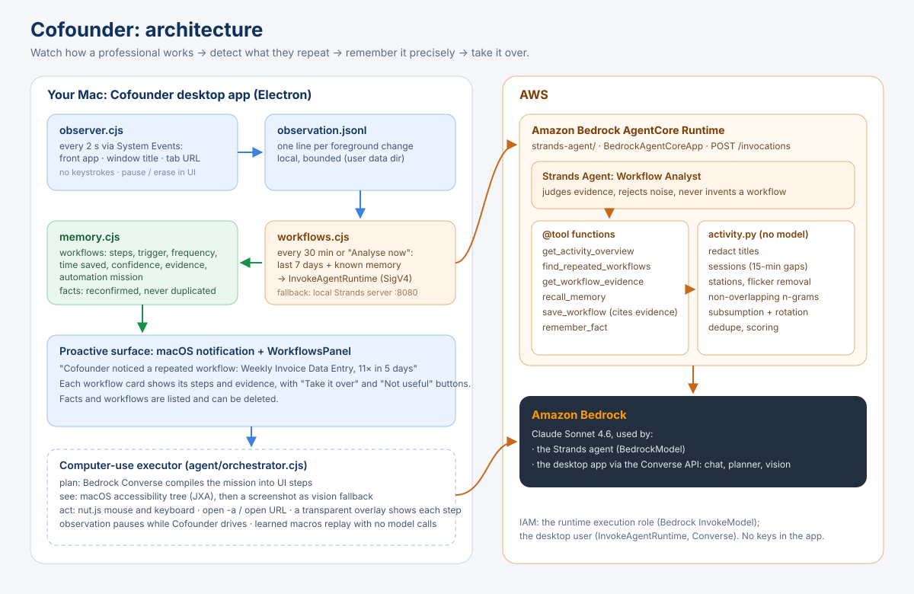

# Cofounder

Cofounder is a macOS desktop app (Electron + Vite + React) for an AI with hands: it
drives your Mac's mouse and keyboard to carry out tasks for you, watches how you work
to detect repetitive workflows, and remembers what it learns. Every model call goes to
**Claude Sonnet 4.6 on Amazon Bedrock** through your own AWS credentials. The app
ships no API keys or secrets.

## Requirements

- macOS
- Node.js 20+
- AWS credentials with Amazon Bedrock model access (for example `~/.aws/credentials`,
  environment variables or AWS SSO). Region defaults to `us-west-2`; override with
  `AWS_REGION`.
- Optional: [uv](https://docs.astral.sh/uv/) to run the Strands workflow agent in
  `strands-agent/`

## Run

```bash
npm install
npm run electron:dev      # Vite dev server (port 5199) + Electron window
```

`npm run dev` starts only the web UI in a browser. Native features (mouse, keyboard,
Bedrock check) are simulated there.

Local accounts and onboarding sessions are stored as JSON in the app's user data
directory (or `~/.cofounder` outside Electron). Nothing is sent anywhere except
Amazon Bedrock.

## macOS permissions

Grant these in **System Settings > Privacy & Security** for the app (or for your
terminal when running in dev):

- **Accessibility**: control the mouse and keyboard.
- **Screen Recording**: see the screen to plan actions and observe workflows.
- **Automation**: control browsers (Safari, Chrome, …) when a task needs them.

## Workflow agent (Strands)

The workflow detection and automation agent lives in `strands-agent/`. See
[strands-agent/README.md](strands-agent/README.md) for setup and usage.

## Architecture



| Layer | File | Role |
|-------|------|------|
| Observation | `electron/observer.cjs` | Front app, window title and tab URL every 2 s (System Events). Never keystrokes |
| Workflow agent | `strands-agent/` | Strands Agents on Amazon Bedrock AgentCore Runtime: mines, judges and saves repeated workflows |
| Agent client | `electron/workflows.cjs` | `InvokeAgentRuntime` every 30 min, or a local Strands server |
| Memory | `electron/memory.cjs` | Workflows and facts, reconfirmed rather than duplicated. Editable in the UI |
| Proactive UI | `src/WorkflowsPanel.tsx` | Observation status, detected workflows, "Take it over", remembered facts |
| Executor | `electron/agent/*` | Bedrock plans; accessibility tree plus vision; nut.js mouse and keyboard |
| Model client | `electron/bedrock.cjs` | Amazon Bedrock Converse API (Claude Sonnet 4.6) |

## Deploy the agent to AgentCore

```bash
npm run deploy:agentcore   # configures and deploys strands-agent/, then writes agentcore-runtime.json
```

Without `agentcore-runtime.json`, the app starts the agent locally with `uv` (`strands-agent/main.py`, port 8080).

**Model fallback.** Amazon Bedrock is the primary model (Claude Sonnet 4.6). If Bedrock cannot serve a call
(quota not granted yet, no credentials, offline), the app and the Strands agent fall back to a local model through
[Ollama](https://ollama.com) (`COFOUNDER_OLLAMA_MODEL`, default `gemma4:e2b`). If AgentCore cannot reach a model,
the app runs the same agent locally.

## Try it with demo activity

```bash
node scripts/seed-demo-activity.cjs   # a synthetic bookkeeper week (no real data)
npm run electron:dev                  # Home → "Analyse now"
```

## Hackathon

Built for the AWS **Agents for Humans** hackathon (Professional Agents track). The submission text,
the video script and the pre-existing code disclosure are in [`HACKATHON.md`](HACKATHON.md).

## License

[MIT](LICENSE)
